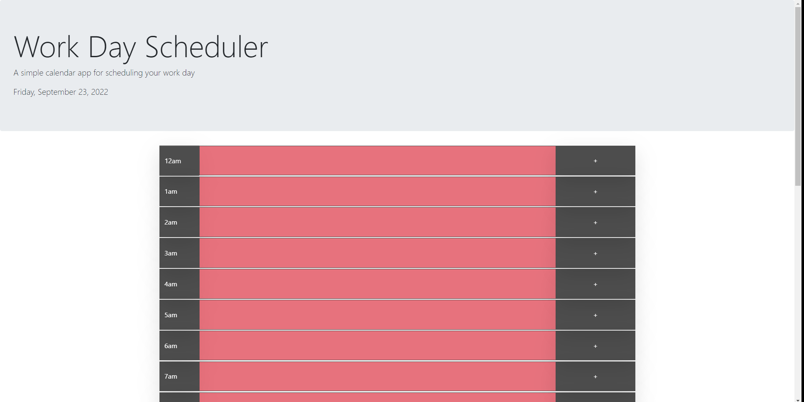

# Work Day Scheduler

## Description
This is a work day scheduler made in JavaScipt/jQuery using moment.js and bootstrap.

## Installation

N/A

## Usage

You can add an event by adding text to an input field then clicking the corresponding button to the right of it.

Events can be cleared by clicking on the hour to the left of the input field.

Event rows are dynamically updated to indicate past, current, and future events.

[Deployed Page](https://wlk-dev.github.io/work-day-scheduler/)

## Credits

N/A
